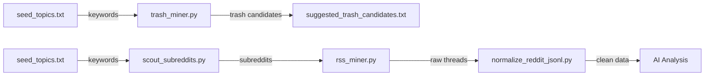

# Trash Miner — Universal Niche Engine

**Automated market intelligence and pain-point discovery.** A powerhouse toolkit for researching **any** niche (SaaS, E-commerce, Services) by mining Reddit and Google insights — all without API keys.

## 🔄 Visual Pipeline Flow



---

## Project Structure

```
trash_miner/
├── config/
│   └── query_packs.json             # Niche-specific search & NLP templates
├── seed_topics.txt                  # Target keywords (one per line)
├── seed_factory.py                  # Generates seeds via Google or LLM Brainstorming
├── scout_subreddits.py              # Dynamically finds relevant subreddits
├── trash_miner.py                   # Mines Google autocomplete for negative keywords
├── rss_miner.py                     # Universal Reddit RSS miner (niche-agnostic)
├── normalize_reddit_jsonl.py        # Normalizers mixed-schema JSONL output
├── data/
│   ├── reddit_threads.jsonl         # Raw mined Reddit threads
│   ├── reddit_threads_normalized.jsonl  # Cleaned output
│   └── seen_post_ids.txt            # Dedup tracker
└── suggested_trash_candidates.txt   # Output from trash_miner
```

---

## Setup

### Requirements

- **Python 3.10+**
- Install dependencies:

```bash
pip install -r requirements.txt
```

> `normalize_reddit_jsonl.py` and `trash_miner.py` use only the standard library — no extra deps needed for those.

---

## Pipeline

The scripts run in order. Each step feeds the next.

### Step 1 — Seed Topics (LLM/Google)

Edit `seed_topics.txt` directly, or use the **Seed Factory** to generate topics from Google's taxonomy or use **LLM Brainstorming** (requires local Ollama):

```bash
# Option A: Google Shopping Taxonomy (Products)
python3 seed_factory.py --source google

# Option B: LLM Brainstorming (Any niche, e.g. SaaS)
python3 seed_factory.py --source llm --topic "CRM software" --count 10
```

**Output:** `seed_topics.txt` — clean list of niche categories.

**Format:**
```
# Lines starting with # are ignored
shirts tops
mugs
posters prints visual artwork
yoga pilates mats
```

---

### Step 2 — Scout Subreddits (Discovery)

Automatically find where people are talking about your keywords. This discovers the best targets for the miner:

```bash
python3 scout_subreddits.py "crm software, sales automation" --limit 5
```

**Output:** Recommends the `--subs` list for the next step.

---

### Step 3 — Trash Mining (Search Intel)

Discovers irrelevant/negative search terms across your product topics using Google Autocomplete:

```bash
python3 trash_miner.py
```

**Output:** `suggested_trash_candidates.txt` — ranked list of words to potentially exclude from campaigns.

---

### Step 4 — Universal Reddit Mining

Scrapes Reddit for pain-point threads using RSS. Uses **Query Packs** (SaaS, E-commerce, Services) to tailor the search.

```bash
# Mine a SaaS niche
python3 rss_miner.py --mode fetch --niche_type saas --subs CRMSoftware,CRM

# Mine an E-commerce niche with a prefix
python3 rss_miner.py --mode fetch --niche_type ecommerce --prefix "best" --subs printondemand
```

```bash
# Dry run — preview all URLs without fetching
python3 rss_miner.py --mode urls

# Fetch search results (default)
python3 rss_miner.py --mode fetch

# Fetch search + top + new feeds, last month
python3 rss_miner.py --mode fetch --include_search --include_top --include_new --t month

# Fetch with comments, only pain points
python3 rss_miner.py --mode fetch --include_comments --max_comments 10 --only_pain_points

# Full run — all feeds, with comments, 25 posts per feed
python3 rss_miner.py --mode fetch \
    --include_search --include_top --include_new \
    --include_comments --max_comments 10 \
    --max_posts 25 --t month
```

| Flag | Default | Description |
|------|---------|-------------|
| `--mode` | *required* | `urls` or `fetch` |
| `--niche_type` | `ecommerce` | `saas`, `ecommerce`, `services`, `learning` |
| `--subs` | *required* | Comma-separated target subreddits |
| `--prefix` | `None` | Optional keyword prefix (e.g. "best") |
| `--t` | `month` | Time window: `day`, `week`, `month`, `year`, `all` |
| `--include_comments` | off | Fetch first 10 comments per post |
| `--only_pain_points` | off | Filter to pain-point patterns only |
| `--out` | `data/reddit_threads.jsonl` | Output file |

**Output:** `data/reddit_threads.jsonl` — one JSON object per line.

---

### Step 5 — Normalize JSONL

Fixes inconsistent schemas from different miner versions (e.g., `feed` vs `feed_type`, `subreddit` vs `subreddit_feed`) into a single clean schema.

```bash
# Basic run
python3 normalize_reddit_jsonl.py

# With dedup and derived fields
python3 normalize_reddit_jsonl.py --dedupe --add_derived_fields

# Strict mode (abort on bad JSON)
python3 normalize_reddit_jsonl.py --strict
```

| Flag | Default | Description |
|------|---------|-------------|
| `--input` | `data/reddit_threads.jsonl` | Input JSONL |
| `--output` | `data/reddit_threads_normalized.jsonl` | Output JSONL |
| `--dedupe` | off | Remove duplicate `post_id` entries |
| `--add_derived_fields` | off | Add `comment_count` and `has_comments` |
| `--strict` | off | Abort on any JSON parse error |

**Output schema** (every line guaranteed):
```json
{
  "fetched_at": "2026-02-20T18:00:00+00:00",
  "feed": "search",
  "title": "...",
  "url": "https://...",
  "summary": "...",
  "author": "/u/...",
  "published": "2026-02-19T12:00:00+00:00",
  "post_id": "abc123",
  "subreddit": "printondemand",
  "is_pain_point": true,
  "comments": [
    {"author": "...", "published": "...", "url": "...", "text": "..."}
  ]
}
```

---

## 📦 Query Packs & Dynamic NLP

The engine uses `config/query_packs.json` to customize both the search strategy and the classification labels for your specific industry. 

### What's inside a Query Pack?
- **Templates**: Search variants to find high-intent conversations (e.g., `{kw} alternatives`, `{kw} vs`).
- **Labels**: Specialized classification buckets for the NLP engine (e.g., `Bug Report`, `Price Comparison`).

**Example: `saas` pack**
```json
"saas": {
  "name": "Software as a Service (SaaS)",
  "templates": ["{kw} alternatives", "{kw} pricing", "{kw} api integration"],
  "labels": ["Bug Report", "Feature Request", "Documentation Gap", "API Issue"]
}
```

---

## 📊 Output Examples (SaaS)

### 1. `suggested_trash_candidates.txt`
Identifies "noise" keywords that you might want to exclude from Google Ads or SEO campaigns.
```text
login (124)    <-- High frequency, likely support noise
password (98)  <-- Customer support intent
forgot (85)    <-- Account issues
free (65)      <-- Low intent searchers
...
```

### 2. `reddit_threads_normalized.jsonl`
Cleaned, enriched data ready for AI analysis or your next spreadsheet.
```json
{
  "fetched_at": "2026-02-18T21:30:38Z",
  "title": "Is there a good CRM that works well with Squarespace?",
  "summary": "I'm looking for a tool that handles leads from Squarespace forms...",
  "subreddit": "CRMSoftware",
  "is_pain_point": true,
  "labels": ["API/Integration Issue", "Pricing Query"]
}
```

---

## Quick Start (Full Pipeline)

```bash
# 1. Install deps
pip install requests feedparser beautifulsoup4 httpx

# 2. Brainstorm seeds (e.g. for SaaS)
python3 seed_factory.py --source llm --topic "CRM tools" --count 5

# 3. Scout subreddits
python3 scout_subreddits.py "crm tools" --limit 3

# 4. Mine Reddit
python3 rss_miner.py --mode fetch --niche_type saas --subs CRMSoftware,CRM

# 5. Normalize & Enjoy
python3 normalize_reddit_jsonl.py --dedupe --add_derived_fields
```

# 💡 Pro-Tips & Troubleshooting

### 1. Handling shell errors (Zsh/Bash)
If you see `zsh: no matches found: [SUBREDDITS]`, it means you left the square brackets in the command. 
- **Incorrect:** `--subs [asana,jira]`
- **Correct:** `--subs asana,jira` (No brackets, no spaces)

### 2. The "Yoga" Problem (Ambiguous Keywords)
Some keywords have multiple meanings. For example, scouting for **"Asana"** will return `r/yoga` as well as `r/asana`. 
- **Tip:** When the `scout_subreddits.py` tool gives you a list, always do a quick "sanity check" and remove irrelevant subreddits before running the `rss_miner`.

### 3. LLM JSON Wrapping
If you use a small local model (like `llama3.2:3b`) with `seed_factory.py`, it may sometimes wrap the list in a key like `{"seeds": [...]}` instead of a plain list. 
- **Fix:** The script has been updated to handle this automatically by searching for any lists inside the returned JSON object.

### 4. Rate Limiting (The "429" Error)
Since this tool uses RSS feeds and doesn't require API keys, it is subject to Reddit's standard rate limits. 
- **Fix:** If you see "Too Many Requests", wait 60 seconds or reduce your `--max_posts` and `--subs` count in a single run.
